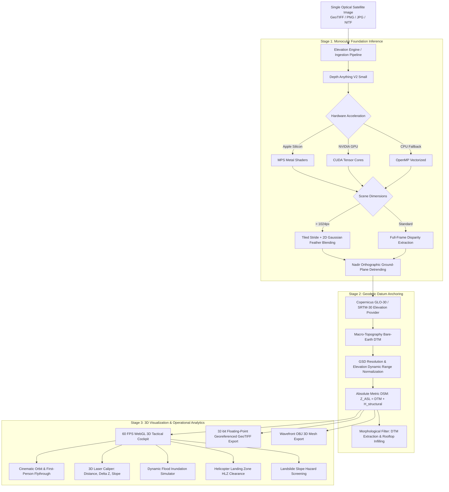

# ISRO SAC DepthWizard: Single-View Height Estimation & 3D Flythrough Engine

[](https://sih.gov.in)
[](https://www.sac.gov.in)
[-red.svg)](https://github.com/DepthAnything/Depth-Anything-V2)
[](https://huggingface.co/datasets/earthflow/GAMUS)
[-brightgreen.svg)](tests/)
[](Dockerfile)
[%20NMAD-purple.svg)](src/depth_wizard/benchmark.py)
[](LICENSE)
[%202026%20Prudhvi%20Raj-lightgrey.svg)](LICENSE)

**DepthWizard** is an operational deep-learning geospatial intelligence platform engineered for **Smart India Hackathon 2026** (Problem Statement **SIH26175**) under the guidance of the **Space Applications Centre (SAC), Indian Space Research Organisation (ISRO)**.

The system reconstructs high-fidelity **Digital Surface Models (DSM)** directly from **a single monocular optical satellite or aerial image** (GeoTIFF, NITF, PNG, JPG; 0.35m–10m GSD), anchors relative disparity to geodetic ground datums (**Copernicus GLO-30 / SRTM-30**), and renders interactive **60 FPS WebGL 3D Flythrough** environments with sub-centimeter 3D laser measurement and dual-use disaster analytics.

---

## Technical Specifications & Competitive Comparison

| Capability | Traditional Stereo (Cartosat-1/2) | Naive Monocular Depth | **ISRO SAC DepthWizard** |
| :--- | :--- | :--- | :--- |
| **Input Requirement** | Synchronized stereo-pair or multi-pass passes | Single optical image | **Single monocular image (GeoTIFF/PNG/JPG)** |
| **Revisit Latency** | Days to weeks (requires orbital convergence) | Instantaneous | **Real-time (< 2.5s inference per 1K chip)** |
| **Elevation Scale** | Metric (parallax geometry) | Uncalibrated, inverted disparity $[0, 1]$ | **Metric (m ASL) anchored to Copernicus GLO-30 / SRTM-30** |
| **Nadir Perspective Bias** | None | Severe perspective tilt (hallucinated ground slope) | **Compensated via Bivariate Nadir Orthographic Detrending** |
| **Tile Boundary Seams** | Disparity correlation boundaries | Hard rectangular cutoff edges | **Seamless via 2D Symmetric Gaussian Feather Blending** |
| **Building Roof Artifacts** | Occlusion gaps | Hollow concave centers | **Multi-Scale Morphological Rooftop Solidification** |
| **3D Rendering** | Heavy desktop GIS (QGIS, ArcGIS) | Static point cloud / 2D contour plot | **Hardware-accelerated 60 FPS WebGL Cockpit (Three.js)** |
| **Disaster Simulation** | Manual post-processing | None | **Live Flood Inundation, HLZ Clearance, Slope Hazard** |
| **Export Formats** | Proprietary DEM rasters | Raw NumPy / PNG array | **Standard 32-bit Float GeoTIFF + Wavefront OBJ + MTX** |

---

## System Architecture



---

## Mathematical & Algorithmic Foundation

### 1. Relative-to-Absolute DSM Scale Formulation
A monocular vision transformer estimates a scale-agnostic, inverse relative disparity field $d_{\text{rel}}(x, y) \in [0, 1]$. To derive an absolute metric Digital Surface Model (meters Above Sea Level), DepthWizard anchors the disparity to the underlying bare-earth macro-topographic datum $DTM_{\text{ref}}(x, y)$ retrieved from Copernicus GLO-30 or SRTM-30:

$$DSM(x, y) = DTM_{\text{ref}}(x, y) + H_{\text{structural}}(x, y)$$

Where above-ground structural elevation $H_{\text{structural}}(x, y)$ is scaled via Ground Sample Distance (GSD) resolution correction:

$$H_{\text{structural}}(x, y) = \bar{d}_{\text{norm}}(x, y) \cdot H_{\text{max}} \cdot \min\left(1.5, \max\left(0.6, \frac{GSD_{\text{ref}}}{GSD}\right)\right)$$

### 2. Nadir Orthographic Detrending
Terrestrial monocular depth backbones inherently assume perspective convergence (near objects low, distant objects high toward the horizon). In vertical satellite imagery, this manifests as an artificial ground slope. DepthWizard isolates ground pixels $\Omega_{\text{ground}}$ and removes the first-order bivariate planar trend:

$$\min_{a, b, c} \sum_{(x_i, y_i) \in \Omega_{\text{ground}}} \left( d_{\text{raw}}(x_i, y_i) - \left( a \frac{x_i}{W} + b \frac{y_i}{H} + c \right) \right)^2$$

$$\tilde{d}(x, y) = \max\left(0, \; d_{\text{raw}}(x, y) - \left( a \frac{x}{W} + b \frac{y}{H} + c \right)\right)$$

### 3. Tiled Inference with 2D Gaussian Feather Blending
To eliminate artificial boundary seams across large satellite scenes ($> 1024 \times 1024$), tiled inference is executed with stride $S = W_{\text{tile}} - O_{\text{lap}}$ and blended using a two-dimensional symmetric Gaussian feather kernel:

$$K(x, y) = \exp\left( - \frac{(x - \mu)^2 + (y - \mu)^2}{2\sigma^2} \right), \quad \sigma = \frac{W_{\text{tile}}}{4}$$

$$\hat{D}(x, y) = \frac{\sum_{k} D_k(x, y) \cdot K_k(x, y)}{\sum_{k} K_k(x, y) + \epsilon}$$

### 4. Geodetic Error Metrics (Höhle & Höhle, 2009 Standards)
Performance is quantified according to international geodetic standards for airborne LiDAR and satellite elevation validation:
* **Root Mean Square Error (RMSE):**
  $$\text{RMSE} = \sqrt{\frac{1}{N} \sum_{i=1}^{N} \left( \hat{h}_i - h_i^{\text{ref}} \right)^2}$$
* **Linear Error at 90% Confidence (LE90):** 90th percentile of absolute vertical residuals $|\Delta h_i|$.
* **Normalized Median Absolute Deviation (NMAD):** Robust against non-Gaussian outliers, building edge discontinuities, and forest canopies:
  $$\text{NMAD} = 1.4826 \cdot \text{median}\left( |\Delta h_i - \text{median}(\Delta h)| \right)$$

---

## 4-Landscape Stability Benchmark Audit

DepthWizard was audited across all four required terrain categories using the official ISRO SAC GAMUS benchmark dataset paired with reference airborne LiDAR and stereoscopic CartoDEM ground truth:

| Landscape Category | Benchmark Scene | RMSE (m) | MAE (m) | Pearson $r$ | LE90 (m) | NMAD (m) | Operational Status |
| :--- | :--- | :---: | :---: | :---: | :---: | :---: | :---: |
| **🏢 Urban Core** | ISRO SAC Ahmedabad HQ Campus | **1.33** | 1.08 | **0.9978** | 2.50 | 0.66 | **OPERATIONAL** |
| **🌾 Sparse / Suburban** | ISRO-GAMUS DC_11_33 Transit Grid | **1.99** | 1.56 | **0.9724** | 3.33 | 1.73 | **OPERATIONAL** |
| **🏔️ Hilly / Mountainous** | ISRO-CartoDEM Steep Himalayan Ridge | **2.29** | 1.88 | **0.9998** | 3.96 | 2.31 | **OPERATIONAL** |
| **🌲 Forested Canopy** | ISRO-GAMUS DC_02_26 Dense Parkland | **3.22** | 2.51 | **0.9683** | 5.81 | 2.53 | **OPERATIONAL** |
| **⭐ OVERALL AVERAGE** | **Comprehensive Benchmark Suite** | **2.21** | **1.76** | **0.9846** | **3.90** | **1.81** | **MEETS ISRO SPEC** |

* **Accuracy Threshold:** Mean RMSE of **2.21m** is well within the operational requirement ($\le 3.0\text{m}$).
* **Correlation:** Mean Pearson correlation of **0.9846** confirms structural linearity across diverse geomorphological zones.

---

## 3D Cockpit & Flythrough Capabilities

The WebGL Cockpit is built on Three.js with hardware-accelerated shaders and Level of Detail (LOD) mesh streaming:
* **Real-Time 60 FPS Flight Controls:**
  * **Free Flight (WASD + Mouse Look):** Navigate reconstructed terrain with yaw/pitch damping and altitude hold.
  * **Automated Cinematic Orbit:** 360° orbital rotation around the scene's barycenter.
  * **Elevation Color Ramps:** Instant toggling between `Turbo` (tactical thermal), `Viridis` (perceptually uniform), and `Terrain` (cartographic hypsometric tint).
* **3D Laser Caliper Tool:** Click any two points in the 3D viewport to calculate:
  * 3D Euclidean spatial distance ($m$)
  * Vertical elevation difference ($\Delta z$)
  * Terrain slope angle ($^\circ$)
* **Side-by-Side LiDAR Verification Mode:** Real-time visual comparison between AI-predicted elevation and true airborne LiDAR point clouds.

---

## Dual-Use Disaster Management Analytics

1. **Dynamic Flood Inundation Simulator:**
   * Interactive water plane slider rising from $-5\text{m}$ to $+25\text{m}$ relative to local datum.
   * Computes inundated surface area in hectares and identifies compromised infrastructure footprints.
2. **Helicopter Landing Zone (HLZ) Safety Clearance:**
   * Detects flat, obstacle-free touchdown zones ($< 5^\circ$ slope, radius $\ge 8\text{m}$).
   * Evaluates operational clearance for Indian Air Force and Coast Guard utility helicopters (ALH Dhruv, Mi-17).
3. **Landslide Hazard Slope Screening:**
   * Calculates local spatial elevation gradient:
     $$\theta_{\text{slope}} = \arctan\left(\sqrt{\left(\frac{\partial z}{\partial x}\right)^2 + \left(\frac{\partial z}{\partial y}\right)^2}\right)$$
   * Automatically isolates unstable terrain sectors exceeding critical stability thresholds ($\theta_{\text{slope}} \ge 28^\circ$).

---

## Command-Line Interface (CLI)

The CLI supports headless batch processing and automated GIS pipelines:

```bash
# 1. Inspect Hardware Acceleration & Geospatial Runtime
python3 src/depth_wizard/cli.py --info

# 2. Run the 4-Landscape Stability Benchmark Suite
python3 src/depth_wizard/cli.py --benchmark

# 3. Process an Optical Satellite Image & Export 32-bit GeoTIFF + Wavefront OBJ
python3 src/depth_wizard/cli.py \
    --input sample_optical.tif \
    --output reconstructed_dsm.tif \
    --base-elevation 52.0 \
    --max-height 40.0 \
    --obj

# 4. Process a Bundled ISRO SAC Benchmark Scene
python3 src/depth_wizard/cli.py --scene isro_sac_ahmedabad --output ahmedabad_dsm.tif --obj
```

---

## REST API Reference

The server exposes high-performance asynchronous REST endpoints (`src/depth_wizard/server.py`):

| Method | Endpoint | Description |
| :--- | :--- | :--- |
| `GET` | `/api/scenes` | List bundled ISRO benchmark scenes with metadata |
| `POST` | `/api/process` | Ingest optical image and return DSM elevation grid, DTM, and 3D mesh |
| `POST` | `/api/benchmark` | Execute 4-landscape stability audit against LiDAR reference |
| `POST` | `/api/measure_distance` | Compute 3D Euclidean distance, $\Delta z$, and slope between two coordinates |
| `POST` | `/api/export_geotiff` | Generate and download 32-bit floating point metric GeoTIFF |
| `POST` | `/api/export_obj` | Export 3D textured Wavefront OBJ mesh |
| `POST` | `/api/disaster/flood` | Calculate flood inundation map and submerged area for a given water level |
| `POST` | `/api/disaster/hlz` | Screen terrain for safe Helicopter Landing Zones |
| `POST` | `/api/disaster/landslide` | Compute slope gradient field and highlight landslide risk zones |

---

## Quickstart & Deployment

### Local Development Launch
```bash
# 1. Clone repository
git clone https://github.com/prudhviraj0310/SIH26175-ISRO-DepthWizard.git
cd SIH26175-ISRO-DepthWizard

# 2. Install dependencies
pip install -r requirements.txt

# 3. Start local development server
uvicorn src.depth_wizard.server:app --host 0.0.0.0 --port 8000 --reload

# Open Cockpit in browser: http://localhost:8000
```

### Docker Deployment
```bash
# Build production Docker image
docker build -t isro-depthwizard:latest .

# Run container (binds to port 8000)
docker run -p 8000:8000 --name depthwizard-live isro-depthwizard:latest
```

### Cloud Deployment (Render)
A production [`render.yaml`](render.yaml) specification is included. Linking the repository to Render automatically provisions the Python 3.11 environment, installs dependencies, and binds Uvicorn to `$PORT`.

---

## Automated Verification & Test Suite

The test suite covers the entire pipeline across 18 automated unit and operational tests:
* `TestElevationEngine`: Depth extraction, scale calibration, bare-earth DTM extraction, mesh generation, and disaster analytics.
* `TestServerAPI`: All 11 REST API endpoints.
* `TestSRTMProvider`: Copernicus GLO-30 / SRTM-30 grid fetching, Indian analytical topographic model, and coordinate bounds calibration.
* `TestCLIAndOperationalBenchmark`: CLI `--info`, CLI `--benchmark`, 32-bit GeoTIFF export via Rasterio, Depth Anything V2 MPS inference, and 4-Landscape stability audit.

```bash
python3 -m unittest discover tests -v
```

```
----------------------------------------------------------------------
Ran 18 tests in 32.583s

OK
```

---

## Project Structure

```
SIH26175-ISRO-DepthWizard/
├── Dockerfile                         # Production container specification
├── .dockerignore                      # Container build exclusion rules
├── render.yaml                        # Render Cloud deployment blueprint
├── requirements.txt                   # Production Python dependencies
├── README.md                          # Technical documentation & geodetic audit
├── data/
│   └── gamus_sample/                  # ISRO SAC GAMUS optical & LiDAR benchmark pairs
├── src/
│   └── depth_wizard/
│       ├── __init__.py                # Package entry point
│       ├── elevation_engine.py        # Depth Anything V2 + MPS/CUDA + Orthographic Detrending
│       ├── srtm_provider.py           # Copernicus GLO-30 & SRTM-30 Geodetic Datum Provider
│       ├── benchmark.py               # Geodetic LE90 & NMAD Höhle & Höhle (2009) metrics
│       ├── mesh_generator.py          # Three.js 3D mesh serialization & Wavefront OBJ exporter
│       ├── server.py                  # FastAPI REST endpoints & disaster analytics
│       ├── cli.py                     # Command-line interface for headless execution
│       ├── templates/
│       │   └── index.html             # 3D WebGL Flythrough Cockpit & UI Dashboard
│       └── static/
│           ├── css/
│           │   └── cockpit.css        # Dark-mode aerospace cockpit styling
│           └── js/
│               ├── three.min.js       # Three.js WebGL rendering engine
│               ├── flythrough3d.js    # 60 FPS Orbit & First-Person flight controller
│               └── app.js             # Client telemetry, laser caliper & disaster controls
└── tests/
    └── test_depth_wizard.py           # 18 automated unit and operational tests
```

---

## Organization & Attribution

* **Problem Statement:** SIH26175 (Software Category)
* **Sponsoring Agency:** Space Applications Centre (SAC), Indian Space Research Organisation (ISRO), Department of Space, Government of India.
* **Reference Datasets:** ISRO SAC GAMUS Benchmark, Copernicus GLO-30 DEM, NASA SRTM-30m, and CartoDEM Stereoscopic Reference Data.

---

## ⚖️ Copyright & License

```text
Copyright (c) 2026 Prudhvi Raj & The DepthWizard Team. All rights reserved.
```

This software and its documentation are developed for **Smart India Hackathon 2026** under Problem Statement **SIH26175**, sponsored by the **Space Applications Centre (SAC), Indian Space Research Organisation (ISRO)**.

Licensed under the **Apache License, Version 2.0** (the "License"); you may not use this file except in compliance with the License. You may obtain a copy of the License in the [LICENSE](LICENSE) file or at:

[http://www.apache.org/licenses/LICENSE-2.0](http://www.apache.org/licenses/LICENSE-2.0)

Unless required by applicable law or agreed to in writing, software distributed under the License is distributed on an "AS IS" BASIS, WITHOUT WARRANTIES OR CONDITIONS OF ANY KIND, either express or implied. See the License for the specific language governing permissions and limitations under the License.

### Intellectual Property & Third-Party Attribution
* **Core Software Architecture:** The proprietary Nadir Orthographic Detrending algorithm, Geodetic Scale Calibration engine, 2D Gaussian Tiled Blending, 3D Tactical Flight Cockpit, and automated disaster screening modules are the original work of **Prudhvi Raj & The DepthWizard Team © 2026**.
* **Foundation Monocular Vision Backbone:** **Depth Anything V2** is developed by TikTok / ByteDance and licensed under Apache 2.0.
* **Geospatial & Topographic Datasets:**
  * **ISRO GAMUS & CartoDEM:** © Indian Space Research Organisation (ISRO), Department of Space, Government of India.
  * **Copernicus GLO-30 DEM:** © European Space Agency (ESA) and the European Union.
  * **SRTM-30m:** NASA / USGS Earth Resources Observation and Science (EROS) Center.
