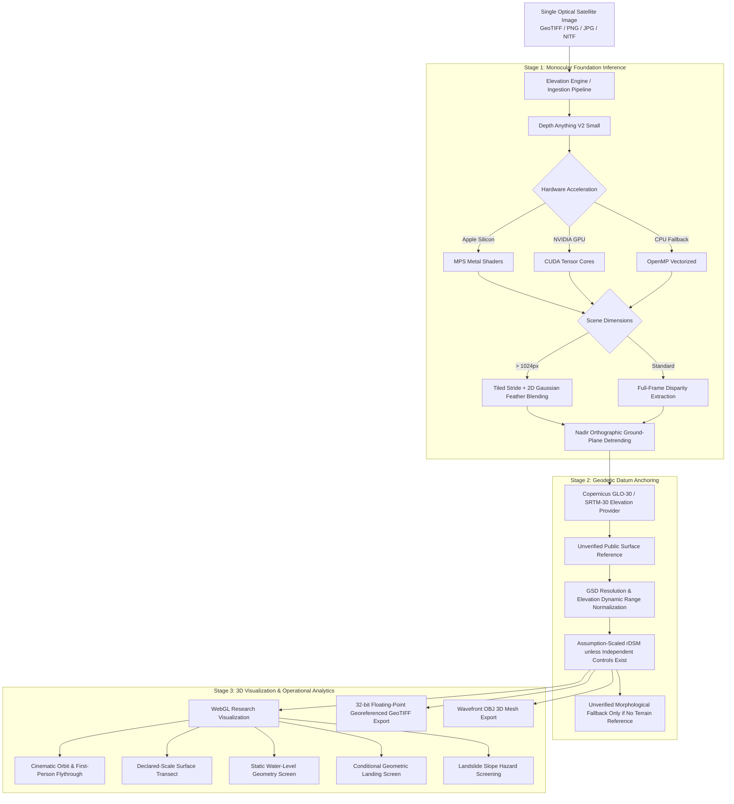

# DepthWizard: Single-View Height Research & 3D Flythrough Prototype

[](https://sih.gov.in)
[](https://www.sac.gov.in)
[-red.svg)](https://github.com/DepthAnything/Depth-Anything-V2)
[](https://huggingface.co/datasets/earthflow/GAMUS)
[](tests/)
[](Dockerfile)
[](src/depth_wizard/benchmark.py)
[](LICENSE)
[%202026%20Prudhvi%20Raj-lightgrey.svg)](LICENSE)

**DepthWizard** is an independent research prototype for **Smart India Hackathon 2026** (Problem Statement **SIH26175**). The problem sponsor is ISRO SAC; that does not establish affiliation, guidance, approval or certification of this implementation.

It renders an appearance-derived, assumption-scaled **rDSM** from an optical image. Metric status requires independent surveyed AGL scale controls and aligned, verified bare-earth terrain/datum; geographic bounds alone are insufficient. Public elevation samples are not certified bare earth. No sub-centimetre accuracy, frame-rate guarantee or operational safety capability is established.

**Research use only — NOT CERTIFIED.** Bundled scenes currently lack these controls. Metric measurements and disaster routes return `NOT_ASSESSED`/HTTP 422. Source/scale status is retained in the UI and exports. Fixing validity and provenance does not prove height accuracy.

---

## Implemented capabilities and limits

- GeoTIFF/PNG/JPG ingestion and cached Depth Anything V2 inference; unavailable neural paths are disclosed.
- Appearance processing and tiled blending are heuristics, not verified removal of nadir bias or roof error.
- Terrain is preserved: `DSM = terrain reference + structural_heights`. IRLS fits independent AGL controls only, never benchmark labels or terrain appearance.
- Three.js flythrough visualization, float32 TIFF and OBJ exports with provenance/control metadata.
- Complete-footprint geometric landing and slope screens; no flight clearance, BIS/TEHD classification, hydrological prediction or ground-stability finding.
- Owned immutable cases with opaque HttpOnly session cookies, TTL and bounded capacity. This is prototype isolation, not authentication/RBAC; deployment across workers needs a shared case store.

---

## System Architecture



---

## Mathematical & Algorithmic Foundation

### 1. Relative-to-Absolute DSM Scale Formulation
A monocular prior is not measured AGL. The terrain/surface reference is retained spatially; an assumed structural-height prior is added unless independent AGL controls support a fitted transform. Copernicus is a DSM, not automatically a DTM, and its API response does not verify an absolute datum:

$$DSM(x, y) = DTM_{\text{ref}}(x, y) + H_{\text{structural}}(x, y)$$

Without independent controls, the height field uses a declared assumption, not a GSD-derived measurement:

$$H_{\text{structural}}(x, y) = d_{\text{rel}}(x, y) \cdot H_{\text{assumed}}$$

### 2. Nadir Orthographic Detrending
Terrestrial monocular depth backbones inherently assume perspective convergence (near objects low, distant objects high toward the horizon). In vertical satellite imagery, this manifests as an artificial ground slope. DepthWizard isolates ground pixels $\Omega_{\text{ground}}$ and removes the first-order bivariate planar trend:

$$\min_{a, b, c} \sum_{(x_i, y_i) \in \Omega_{\text{ground}}} \left( d_{\text{raw}}(x_i, y_i) - \left( a \frac{x_i}{W} + b \frac{y_i}{H} + c \right) \right)^2$$

$$\tilde{d}(x, y) = \max\left(0, \; d_{\text{raw}}(x, y) - \left( a \frac{x}{W} + b \frac{y}{H} + c \right)\right)$$

### 3. Tiled Inference with 2D Gaussian Feather Blending
To eliminate artificial boundary seams across large satellite scenes ($> 1024 \times 1024$), tiled inference is executed with stride $S = W_{\text{tile}} - O_{\text{lap}}$ and blended using a two-dimensional symmetric Gaussian feather kernel:

$$K(x, y) = \exp\left( - \frac{(x - \mu)^2 + (y - \mu)^2}{2\sigma^2} \right), \quad \sigma = \frac{W_{\text{tile}}}{4}$$

$$\hat{D}(x, y) = \frac{\sum_{k} D_k(x, y) \cdot K_k(x, y)}{\sum_{k} K_k(x, y) + \epsilon}$$

### 4. Descriptive Error Metrics
These array-difference metrics do not certify compliance with an agency or geodetic standard:
* **Root Mean Square Error (RMSE):**
  $$\text{RMSE} = \sqrt{\frac{1}{N} \sum_{i=1}^{N} \left( \hat{h}_i - h_i^{\text{ref}} \right)^2}$$
* **LE90:** 90th percentile of absolute residuals $|\Delta h_i|$; not a statistically calibrated confidence guarantee.
* **Normalized Median Absolute Deviation (NMAD):** Robust against non-Gaussian outliers, building edge discontinuities, and forest canopies:
  $$\text{NMAD} = 1.4826 \cdot \text{median}\left( |\Delta h_i - \text{median}(\Delta h)| \right)$$

---

## Descriptive Landscape Benchmark

The historical 1–3 m results and `MEETS ISRO SPEC` labels above were unsupported and have been withdrawn, not replaced by a looser threshold. The campus and ridge are procedural fixtures, not SAC campus or CartoDEM scans. Bundled GAMUS H5 AGL values retain raw semantics and an explicitly assumed fixed base; source registration/datum still needs independent verification.

The current HTTP/CLI benchmark refuses metre-accuracy evaluation when independent controls are absent; the four bundled categories therefore report explicit failures and null metrics. This is a validity repair, **not improved model accuracy**. Controlled regression inputs separately verify actual metric arithmetic, catastrophic-error disclosure, partial failures and synthetic provenance.

For valid inputs, report per-scene errors, support counts, undefined correlation as null, and separate real/synthetic/unknown groups. Macro means give scenes equal weight; pooled metrics give valid pixels equal weight. No approval tier or agency threshold is applied. HTTP states are 200/207/503 for SUCCESS/PARTIAL/FAILED; CLI exit codes are 0/2/1 respectively.

---

## 3D Cockpit & Flythrough Capabilities

The WebGL Cockpit is built on Three.js with hardware-accelerated shaders for research visualization; frame rate and device support are hardware-dependent:
* **Interactive Visualization Controls (frame rate hardware-dependent):**
  * **Free Flight (WASD + Mouse Look):** Navigate reconstructed terrain with yaw/pitch damping and altitude hold.
  * **Automated Cinematic Orbit:** 360° orbital rotation around the scene's barycenter.
  * **Elevation shading:** Toggle relief, hillshade, optical, slope and wireframe views; these are visualization layers, not accuracy classes.
* **3D Surface Transect:** Click two points in the viewport for declared-scale distance, surface difference and slope values only when the case has independent metric controls. They are not geodetic survey measurements.
* **Reference View:** Visual comparison with procedural reference or bundled AGL + assumed base; not independently verified airborne LiDAR geometry.

### Experimental LoD-1 building blocks

`src/depth_wizard/lod1_extractor.py` can turn a supplied DSM/DTM pair into simplified block-like footprints with connected components, morphological cleanup, Ramer–Douglas–Peucker simplification and percentile roof heights. This is useful for **visualization**, not for proving building footprints, roof heights, cadastral geometry or metric accuracy.

Important implementation limits:

- The current function uses distance-transform markers and watershed when separable peaks exist, with connected-components fallback for simpler masks. This is still a heuristic instance-separation method, not a validated building detector.
- The API passes its calibrated terrain reference into the mesh path when one exists. Direct callers without a terrain grid receive a `UNVERIFIED_MORPHOLOGICAL_FALLBACK`; neither path is labeled a surveyed bare-earth DTM unless provenance explicitly satisfies the verified-DTM contract.
- Nonfinite/masked grids are rejected or excluded from the extractor, and invalid/zero/tiny GSD or thresholds are rejected. Mesh payloads distinguish `SUCCESS`, `EMPTY`, and `FAILED` LoD-1 extraction states and include `lod1_dtm_status`/`lod1_dtm_authoritative`.
- Both SciPy components and OpenCV watershed retain valid support; unavailable holes stay excluded after morphology and from area/height statistics. Touching-instance separation is only demonstrated on controlled fixtures with separable seeds, not guaranteed for adjacent real roofs.
- Descriptive slope derivatives use source-surface values and per-axis physical spacing after raster resampling; the geometry smoothing remains a display heuristic. None of this establishes metric scale for an uncalibrated case.
- The synthetic block fixture and regression tests exercise geometry and finite-input handling; these are visualization smoke results, not a building-detection benchmark. No independent LoD-1 evaluation set is currently reported.

---

## Dual-Use Disaster Management Analytics

1. **Static Water-Level Geometry Screen:**
   * Metric screen offsets from $0\text{m}$ to $+25\text{m}$ above the surface minimum are available only with independent metric controls. The separate visual water-plane slider is a fraction of display relief, not a physical water elevation or flood forecast.
    * No drainage, flow, defence, rainfall or hydraulic model is assessed.
2. **Geometric Landing Candidate Screen:**
   * Detects flat, obstacle-free touchdown zones ($< 5^\circ$ slope, radius $\ge 8\text{m}$).
    * Does not assess flight safety, aircraft performance, bearing strength, weather, approach paths or reconnaissance.
3. **Landslide Hazard Slope Screening:**
   * Calculates local spatial elevation gradient:
     $$\theta_{\text{slope}} = \arctan\left(\sqrt{\left(\frac{\partial z}{\partial x}\right)^2 + \left(\frac{\partial z}{\partial y}\right)^2}\right)$$
    * Reports geometric slope bands only; geology, hydrogeology, structure and field factors are missing. Low slope does not establish stability. Invalid/NaN/masked inputs return NOT_ASSESSED.

---

## Command-Line Interface (CLI)

The CLI supports headless batch processing and automated GIS pipelines:

```bash
# 1. Inspect Hardware Acceleration & Geospatial Runtime
python3 src/depth_wizard/cli.py --info

# 2. Run the 4-Landscape Descriptive Benchmark Suite
python3 src/depth_wizard/cli.py --benchmark

# 3. Process an Optical Satellite Image & Export 32-bit GeoTIFF + Wavefront OBJ
python3 src/depth_wizard/cli.py \
    --input sample_optical.tif \
    --output reconstructed_dsm.tif \
    --base-elevation 52.0 \
    --max-height 40.0 \
    --obj

# 4. Process the procedural campus fixture (not a SAC campus scan)
python3 src/depth_wizard/cli.py --scene isro_sac_ahmedabad --output ahmedabad_dsm.tif --obj
```

---

## REST API Reference

The actual routes are in `src/depth_wizard/server.py` and `/docs`:

- `GET /api/health`, `GET /api/scenes`: health and truthful catalogue metadata.
- `POST /api/scene/select`, `POST /api/upload`: publish an owned immutable case.
- `GET /api/benchmark` (alias `/api/benchmark/run`): descriptive benchmark/refusal.
- `POST /api/measure`: metric measurements only when scale is independently established.
- `GET /api/export/dsm`, `/api/export/obj`, `/api/export/metadata`: same owned/viewed geometry with metadata.
- `POST /api/disaster/flood`, `/api/disaster/landing-zones`, `/api/disaster/landslide`: conditional geometry screens; no safety certification.

Follow-up requests use the HttpOnly session cookie. An optional `case_id` query parameter or `X-DepthWizard-Case` selects a prior owned case. Missing/expired active cases return 409; another session's explicit case returns 404. Prototype cases expire after 30 minutes and do not survive restart.

Health `AVAILABLE` describes service availability only; neural availability is separate, and operational readiness/metric accuracy remain `NOT_ASSESSED`. Browser assessment responses are checked against the current case/revision, including errors, so an old response cannot overwrite a newly loaded case. LoD-1 status and terrain-source declarations are displayed explicitly.

---

## Quickstart & Deployment

### Local Development Launch
```bash
# 1. Clone repository
git clone https://github.com/prudhviraj0310/SIH26175-ISRO-DepthWizard.git
cd SIH26175-ISRO-DepthWizard

# 2. Install dependencies
pip install -r requirements.txt

# 3. Start local development server
uvicorn src.depth_wizard.server:app --host 0.0.0.0 --port 8000 --reload

# Open Cockpit in browser: http://localhost:8000
```

### Docker Deployment
```bash
# Build production Docker image
docker build -t isro-depthwizard:latest .

# Run container (binds to port 8000)
docker run -p 8000:8000 --name depthwizard-live isro-depthwizard:latest
```

### Cloud Deployment (Render)
A production [`render.yaml`](render.yaml) specification is included. Linking the repository to Render automatically provisions the Python 3.11 environment, installs dependencies, and binds Uvicorn to `$PORT`.

---

## Automated Verification & Test Suite

Tests cover scale refusal, consistent terrain decomposition, independent-control IRLS, nodata/mask handling, conservative landing geometry, API isolation, TTL/concurrency, float exports, catastrophic/incomplete metrics and synthetic disclosure. They are regression tests, not operational qualification.

```bash
HF_HUB_OFFLINE=1 TRANSFORMERS_OFFLINE=1 python3 -m unittest discover tests -v
HF_HUB_OFFLINE=1 TRANSFORMERS_OFFLINE=1 python3 -m unittest discover src/depth_wizard/tests -v
node --test --test-reporter=tap tests/frontend_runtime.cjs
```

Final verification on 4 October 2026: **95 canonical Python tests passed, zero failures/errors/skips**, and **6 runtime JavaScript scenarios passed**. Nested discovery forwards to the same 95 tests; it is not additional independent coverage. Both browser-controller syntax checks, Python compilation, and `git diff --check` passed. Actual local HTTP processing also loaded all five bundled scenes in both appearance and reference modes and exported the active reference surface as TIFF/OBJ. Health is service availability only; case-specific controls reject stale responses and LoD-1 provenance/status is visible.

The suite does not constitute LoD-1 building-detection validation: there is no independent footprint/height benchmark or survey-backed DTM validation. The benchmark still reports `FAILED / NOT CERTIFIED` when independent metric controls are absent. Run the command in an environment containing `requirements.txt`; model-cache availability is reported by the runtime.

The legacy nested discovery forwards to the canonical root suite. Its constant-error tolerances and formerly unreachable IRLS/refusal test are retained in `tests/test_depth_wizard.py`; geographic bounds alone still do not establish metric status. Offline Node scenarios exercise deferred responses, stale errors, per-case UI clearing, illustrative water-plane semantics and late texture callbacks without a new dependency.

---

## Project Structure

```
SIH26175-ISRO-DepthWizard/
├── Dockerfile                         # Production container specification
├── .dockerignore                      # Container build exclusion rules
├── render.yaml                        # Render Cloud deployment blueprint
├── requirements.txt                   # Production Python dependencies
├── README.md                          # Research prototype documentation and limits
├── data/
│   └── gamus_sample/                  # Bundled GAMUS RGB/AGL pairs (datum unverified)
├── src/
│   └── depth_wizard/
│       ├── __init__.py                # Package entry point
│       ├── elevation_engine.py        # Depth Anything V2 + MPS/CUDA + Orthographic Detrending
│       ├── srtm_provider.py           # Public elevation samples with provenance/refusal
│       ├── case_store.py              # Owned immutable bounded process-local cases
│       ├── benchmark.py               # Descriptive RMSE/LE90/NMAD metrics with provenance groups
│       ├── mesh_generator.py          # Terrain/LoD-1 payload & Wavefront OBJ exporter
│       ├── lod1_extractor.py          # Experimental watershed/RDP block-footprint extraction
│       ├── server.py                  # FastAPI REST endpoints & disaster analytics
│       ├── cli.py                     # Command-line interface for headless execution
│       ├── templates/
│       │   └── index.html             # 3D WebGL Flythrough Cockpit & UI Dashboard
│       └── static/
│           ├── css/
│           │   └── cockpit.css        # Dark-mode aerospace cockpit styling
│           └── js/
│               ├── three.min.js       # Three.js WebGL rendering engine
│               ├── flythrough3d.js    # Orbit & First-Person visualization controller
│               └── app.js             # Client telemetry, laser caliper & disaster controls
└── tests/
    ├── test_depth_wizard.py           # Legacy integration checks with honest contracts
    ├── test_terrain_regressions.py    # Control, consistency and geometric-screen tests
    ├── test_support_regressions.py    # Masked-support follow-ups
    ├── test_lod1_extractor.py         # LoD-1 validation and finite-input contracts
    ├── test_mesh_regressions.py        # Mesh/DTM provenance and payload contracts
    ├── test_cli_regressions.py         # CLI exporter integration checks
    ├── test_frontend_regressions.py    # Video UI labels, stale-error clearing and JS syntax
    └── test_api_integrity_regressions.py # Case/API/benchmark integrity tests
```

---

## Organization & Attribution

* **Problem Statement:** SIH26175 (Software Category)
* **Sponsoring Agency:** Space Applications Centre (SAC), Indian Space Research Organisation (ISRO), Department of Space, Government of India.
* **Inputs:** Bundled GAMUS RGB/AGL samples, procedural campus/ridge fixtures, and optional public elevation API samples. No CartoDEM reference or certified ISRO performance has been verified by this repair.

### Research references and attribution boundary

- **Biljecki et al. (2016),** *Formalisation of the Level of Detail concept in 3D city models*: provides LoD terminology; it does not validate this extractor's footprints or heights.
- **Ramer (1972) / Douglas & Peucker (1973):** provides line simplification; it does not recover building geometry from an unvalidated DSM.
- **Depth Anything V2:** provides the relative-depth backbone; a model checkpoint is not independent metric validation.

These references explain methods used or discussed by the prototype. They are not endorsements, agency acceptance, field accuracy certificates or evidence that the bundled scenes are official agency surveys.

---

## ⚖️ Copyright & License

```text
Copyright (c) 2026 Prudhvi Raj & The DepthWizard Team. All rights reserved.
```

This software and its documentation are developed for **Smart India Hackathon 2026** under Problem Statement **SIH26175**, sponsored by the **Space Applications Centre (SAC), Indian Space Research Organisation (ISRO)**.

Licensed under the **Apache License, Version 2.0** (the "License"); you may not use this file except in compliance with the License. You may obtain a copy of the License in the [LICENSE](LICENSE) file or at:

[http://www.apache.org/licenses/LICENSE-2.0](http://www.apache.org/licenses/LICENSE-2.0)

Unless required by applicable law or agreed to in writing, software distributed under the License is distributed on an "AS IS" BASIS, WITHOUT WARRANTIES OR CONDITIONS OF ANY KIND, either express or implied. See the License for the specific language governing permissions and limitations under the License.

### Intellectual Property & Third-Party Attribution
* **Core Software Architecture:** The Nadir Orthographic Detrending heuristic, terrain-reference/height-scale pipeline, 2D Gaussian Tiled Blending, 3D visualization cockpit, and conditional geometry screens are original work of **Prudhvi Raj & The DepthWizard Team © 2026**.
* **Foundation Monocular Vision Backbone:** **Depth Anything V2** is developed by TikTok / ByteDance and licensed under Apache 2.0.
* **Geospatial & Topographic Datasets:**
  * **ISRO GAMUS & CartoDEM:** © Indian Space Research Organisation (ISRO), Department of Space, Government of India.
  * **Copernicus GLO-30 DEM:** © European Space Agency (ESA) and the European Union.
  * **SRTM-30m:** NASA / USGS Earth Resources Observation and Science (EROS) Center.
